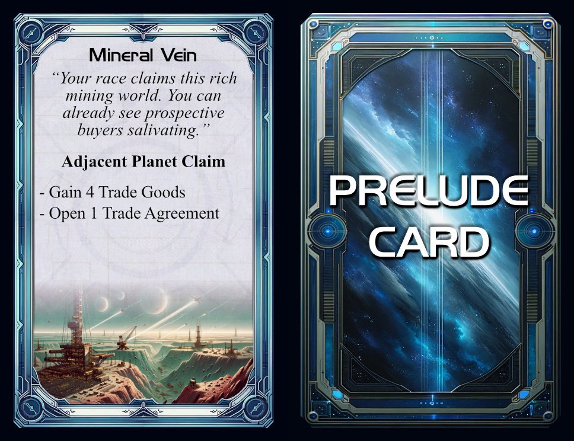

# The Prelude Variant
*V1_2023-10-16*  
***By Cyrusa and Cue***  

> Prelude is a variant for Twilight Imperium:Shattered Ascension, that aims to replace the usual first 2 rounds of territorial claims and expansions with a higher level setup process, in order to reach the midgame (roughly round 3) quicker and with interesting board configurations.

> **Disclaimer:** Since the approach of the Prelude variant is to abstractly simulate the early game to gain time, it will not fully take into account all the details and subtle interactions of a normal early game of Shattered Ascension, like timing or Leaders.

## Table of Contents

- [Components](#components)
- [General Rules and Definitions](#general-rules-and-definitions)
- [Process](#process)

-----

## Components

- A deck of 60ish **Prelude Cards**, each containing a list of **Perks** and displaying an **initiative number**.
- 18 special **Racial Prelude Cards**, one for each playable race
- 8 identical **Basic Prelude Cards**, one for each potential player, each featuring as perk: "Range 1 system claim, increase that range value by 1 for each of these technologies your race starts with: Ion Drive, XRD Transporters, Stasis Capsules. 2 Trade Goods. 1 Action Card."

	

## General Rules and Definitions
- The complete process described in this variant is referred to as **the prelude** in this booklet.
- Each player has a **Quick Reaction Force** (**QRF** for short) area to store the units they will then send on claims. These areas are private.
- **Leaders** have no effect during the prelude, and enter play after it is complete, at any friendly planets or ships.
- **Technologies** have no effect during the prelude, except during combats. When a Prelude Card lets a player choose a Technology to gain, pre-requisites apply.
- **Racial Abilies** have no effect during the prelude, except combat-related ones.
- **Retreats** are not possible during the prelude.
- Each player will have a hand of Prelude Cards, each featuring an initiative number. The **initiative** of a player is the lowest initiative number among their cards. A player is said to **have initiative** over another when their initiative is lower. Doing something in **initiative order** means the player with initiative does it first, then the player the second-lowest initiative, etc.

### Claims
Most Prelude Cards contain a **Claim**. Players use these to expand their territory during the prelude. For each Claim, they will choose a planet or system to target with it, and will assign units to it. There are different types of claims.

**Types of Claims**
- Planet Claim: target a single planet. Only ground units, PDS and Space Docks can be assigned to that claim.
- System Claim: target an entire system. Any units can be assigned to that claim, but if ground units, PDS or a Space Dock are assigned, at least one non-Fighter ship must also be assigned.

Additionally, each Claim has an indicated range.

**Range of a Claim**
- "Range 2": the target of that claim must be 2 spaces away or less from the player's Home System. For this purpose, Supernova and Collapsed Space-Time completely block the range calculation, and flippable wormholes are treated as having both wormholes active.
- "Adjacent": the target of that claim must be adjacent to the player's Home System, or to a system/planet that is the target of one of their other claims.
- Other: some claims have more specific ranges, or none at all.

Some Claims have additional specifications as to what they can target, like requiring a specific colour of Technology Specialty to be present.

## Process

### Game Setup
Follow the normal Shattered Ascension setup procedure with one exception: skip the Speaker Bidding step.

### Phase 1: Prelude Cards Selection

1. **Agendas**. Reveal the top 3 Political Cards from the deck. They will be voted on in Phase 3
2. **Pre-set Prelude Cards**. Player get their race-specific Prelude Card, and a Basic Prelude Card
3. **Draw and select Prelude Cards**. Players draw 7 Prelude Cards, and discard 3 of them face-down

### Phase 2: Quick Reaction Force

1. **Strating Units**. Players place their starting Space Dock in their Home System. The rest of their starting units goes to their Quick Reaction Force.
2. **Production**. In secret, players produce units at their starting Space Dock, respecting its production capacity and using the resource value of their Home System for payment. They place these units in their Quick Reaction Force.
3. **Additional Units**. If they hold Prelude Cards granting QRF units, they add them to their Quick Reaction Force.

### Phase 3: Claims

1. **Assignments**. In secret, players assign units from their Quick Reaction Force to their Prelude Cards with claims, and choose which system/planets these claim target. Unassigned units are considered as assigned to their Home System. Some Prelude Cards grant units, add them as assigned to the claim of that card.
2. **Claim Reveal**. All Prelude Cards, along with their target and assigned units are revealed. Units assigned to planet claims are placed on these planets, while units assigned to a system claim are placed in space for the time being
3. **Space Battles**. For each system containing ships of 2 players, resolve a Space Battle. The player with initiative is the defender (intuitively, he moved there first with lower initiative, then the other player arrived). Refer to the special case below if more than 2 players have ships in the same system. If a player loses all their ships in a system, all the ground units, PDS and Space Docks they also assigned to that system are destroyed.
4. **Space Domain Counters**. Resolve every space Domain Counter where a player's ship are present.
5. **Ground Assignment**. In initiative order, players with ground units, PDS or Space Dock assigned to a system may assign them to specific planets of that system. These units that did not get assigned to a planet must be placed on ships in the system with adequate capacity, or be destroyed.
6. **Invasion Combats**. For each planet containing units of 2 players, resolve an Invasion Combat. If one of them has ships in the system, then they are the attacker. Otherwise, the player with initiative is the defender. Ships of the attacker can bombard (but may only bombard in a single Invasion Combat in that system).
7. **Ground Domain Counters**. If a planet contains Domain Counters and a player's units, resolve them.
8. **Planet Cards**. Players take the planet cards of the planets they now control (refreshed).

**Special Case: 3+ players have units contesting the same space/planet**
If a system/planet contains ships/units of more than 2 players, the player with initiative resolves (as the defender) a Space Battle/Invasion Combat against the player with the second-lowest initiative. Repeat this process until at most 1 player has units left. Exception: if a player contests a planet in a system in which they have ships, they are treated as having the highest initiative of all contestants.

### Phase 4: Finalisation
1. **Speaker Bidding**. Perform the normal Speaker Bidding step, with the difference that players bid with their actual Trade Goods, and the winner simply pays their bids instead of everyone else gaining Trade Goods.
2. **Assembly**. Conduct an Assembly. Players have as many votes as double the influence value of their Home System. Voice of the Council can be called.
3. **Trade**. Players with Perks relative to opening Trade Agreements can use them to open Trade Agreements between willing players. They can open Trade Agreements they are not a part of.
4. **Victory Points**. Every player gains 2 Victory Points.
5. **Racial Upgrade**. Conduct the "Unlock Racial Upgrades" step of the Status Phase. Players can only use their Trade Goods to pay.
6. **Command Counters**. Players can redistribute the Command Counters on their race sheet.

<!-- 

	
TODO

Something important missing?

 -->