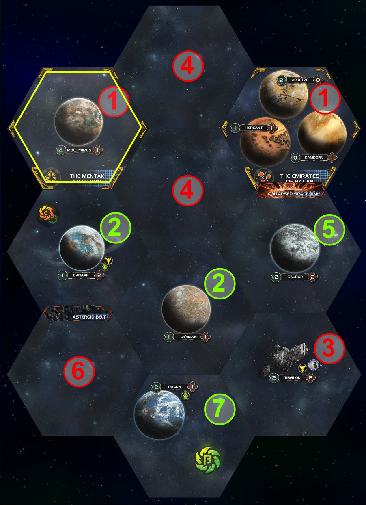

# The Prelude Variant
*Draft version 10 - 2023-12-24*  
***By Cyrusa and Cue***  

> Prelude is a variant for Twilight Imperium:Shattered Ascension, that aims to replace the usual first 2 rounds of territorial claims and expansions with a higher level setup process, in order to reach the midgame (roughly round 3) quicker and with interesting board configurations.

> **Disclaimer:** Since the approach of the Prelude variant is to abstractly simulate the early game to gain time, it will not fully take into account all the details and subtle interactions of a normal early game of Shattered Ascension, like timings or precise opening moves.

## Table of Contents

- [Components](#components)
- [General Rules and Definitions](#general-rules-and-definitions)
	- [Claims](#claims)
	- [Leaders](#leaders)
	- [Perk Timing](#perk-timing)
- [Process](#process)
	- [Game Setup](#game-setup)
	- [Phase 1: Preparation](#phase-1-preparation)
	- [Phase 2: Planning](#phase-2-planning)
	- [Phase 3: Tactics](#phase-3-tactics)
	- [Phase 4: Finalisation](#phase-4-finalisation)
- [Changelog](#changelog)	

-----

## Components

- A deck of 60ish **Prelude Cards**, each containing a list of **Perks**.
- 18 special **Racial Prelude Cards**, one for each playable race
- 8 identical **"Opening Move" Prelude Cards**, one for each potential player, each featuring as perk: "Range 1 system claim, increase that range value by 1 for each of these technologies your race starts with: Ion Drive, XRD Transporters, Stasis Capsules. 2 Trade Goods. 1 Action Card."

	

## General Rules and Definitions
- **Prelude**. The complete process described in this variant is referred to as **the prelude** in this booklet.
- **Initiative** defines an ordering of the player. The Speaker has an initiative of 1, the next player (following the Rotation Cycler) has 2, etc. When there is a timing conflict between two effects or decisions, the player with lowest initiative goes first.
- **QRF/Quick Reaction Force**. Each player has a Quick Reaction Force (QRF for short) area to store the units they will then send on claims. These areas are private.
- **Technologies**. During the prelude, races can only use the Technologies they started with. *Yellow technologies and Xenopsychology are also not useable*. This implies that Technologies acquired during the prelude have no effect until the game start.  When a Prelude Card lets a player choose a Technology to gain, pre-requisites apply.
- **Racial Abilies** have no effect during the prelude, except combat-related ones.
- **Fighter Capacity** and **Fleet Supply** are not checked during the prelude. They start being checked again when the prelude is over.
- **Action Cards** cannot be played during the prelude.
- **Trade Goods** can be spent and exchanged normally, except when explicitly disallowed.
- **Planets** may not be used to pay costs.
- **Objectives** may not be claimed, except Special Objectives (green).

### Claims
Most Prelude Cards contain a **Claim**. Players use these to expand their territory during the prelude. For each Claim, they will choose a planet or system to target with it, and will assign units to it. Each Claim has a type and a range, the possibilities are listed below, as well as additional restrictions as to the target of Claims.

	

**Types of Claims**  

- **Planet Claim**  
Target a single planet (not a Trade Station). Only ground units, PDS, Space Docks and Leaders can be assigned to that claim. 
- **System Claim**  
Target an entire system. Any units/Leaders can be assigned to that claim, but if at least one non-ship is assigned to it, then at least one non-Fighter ship must also be assigned.

**Range of a Claim**

- **Range *N***  
The target of that Claim must be *N* spaces away or less from the player's Home System.
- **Adjacent**  
The target of that Claim must be adjacent to the player's Home System, or to a system/planet that is the target of one of their other Claims.
- **Other**  
Some Claims have more specific ranges, or no range restriction at all.

**Additional rules regarding Claims**

- **Impassable Systems**  
Claims may not target Asteroid Fields or Supernovae.
- **Obstacles**  
When computing the range of a Claim,
	- **Supernovae** and **Collapsed Space-Time** block the range.
	- **Asteroid Fields/Belts** block the range for races which do not start with the Antimass Deflectors Technology.
	- **Standing Grav-Wave** block the range except in the direction indicated by the token.
- **Flippable Wormholes**  
When computing the range of a Claim, treat flippable Wormholes as having both sides active.
- **Sovereign Space**  
Claims may not target systems adjacent to enemy Home System, unless there is a Collapsed Space-Time between the two systems.
- **No Home Systems**  
Players may not target Claims at Home Systems, even their own.
- **One Claim per System (per Player)**  
Players may not have two Claims in the same System.
- **Worldgates**  
Worldgates do not affect range calculations for Claims, but if a player targets a Claim at a system/planet with a worldgate, they can do a bonus planet Claim (without a Prelude Card) targeting another worldgate planet. Other Adjacent Claims may not compute their target from that bonus Claim. This bonus Claim does not trigger this effect again.

**Example**

The following example shows which systems Mentak, whose Home System in the top-left, could target with a System Claim of range 2:

	

		<!--  -->
		
	

	

		<ol>
			<li>Illegal, because Claims cannot target Home Systems</li>
			<li>Legal</li>
			<li>Illegal, because too far away (distance 3)</li>
			<li>Illegal, because adjacent to an enemy Home System</li>
			<li>Legal, because a Collapsed Space-Time separates it from the enemy Home System</li>
			<li>Illegal, because Mentak does not start with Antimass Deflectors to cross the Asteroid Belt. It would be legal if Mentak had a Range 3 Claim</li>
			<li>Legal, because it is 2 systems away, since flippable wormhole tokens count as both wormhole types</li>
		</ol>
	

### Leaders
Leaders can also be assigned to Claims. They have their usual abilities, except Diplomats (see below). Fate Rolls during the Prelude happen at the end of Phase 3.

For the prelude, the abilities of Diplomats are replaced with:

**Annexation Treaty**  
*In the appropriate step of Phase 3, Diplomats may use the Secondary Ability of the Diplomacy Strategy Card for free, in their system or an adjacent one.*

**Ceasefire +**  
*A Diplomat may let players retreat before Space Battle/Invasion Combats in their system (when used, no combat takes place).*

<!-- **Diplomatic Immunity**  
*If a Diplomat participates in an Invasion Combat, the opponent will have to lose control of a planet at the end of Phase 3 (they move their units/Leaders from that planet to their Home System beforehand).*

**Claim Negociation**  
*After Claims are revealed, if a player has a Claim in a system containing an enemy Diplomat, they may instead change the target of that Claim to an adjacent system containing no Claims. They must respect the type of the Claim (planet/system), but ignore its other restrictions (like a specific technology specialty).* -->

### Perk Timing

The timing for obtaining the Perks listed on the Prelude Cards are as follow:  

- Perks giving units (to QRF or not) are resolved in Phase 2, in the Claims step.
- Perks related to votes and agendas are resolved in Phase 4, in the Assembly step.
- Perks related to trade agreements are resolved in Phase 4, in the Trade step.
- Every other Perk, unless it has an explicit timing, is resolved in Phase 2, in the Perks step.

## Process

### Game Setup
Follow the normal Shattered Ascension setup procedure.

### Phase 1: Preparation

1. **Agendas**. Reveal the top 5 Political Cards from the deck. They will be voted on in Phase 4
2. **Starting Prelude Cards**. Player get their race-specific Prelude Card, and an "Opening Move" Prelude Card
3. **Starting Units**. Players place their starting Space Dock in their Home System. The rest of their starting units and Leaders goes to their Quick Reaction Force.

### Phase 2: Planning

**No Negociations Allowed.**  
During this phase, players are not allowed to discuss or negotiate with each others.

**Secret.**  
With the exception of the last step, this Phase is done in secret by all players. They do not show which Prelude Cards they keep, which units they gain/produce, what they target their Claims at...

1. **Draw and select Prelude Cards**. Players draw **7** Prelude Cards. Note that they will only get to use **4** of these.
2. **Production**. Players produce units at their starting Space Dock, respecting its production capacity and *exclusively* using the resource value of their Home System for payment (this does not exhaust their Home System planets). They place these units in their Quick Reaction Force.
3. **Additional Units**. If they hold Prelude Cards granting QRF units, they add them to their Quick Reaction Force.
4. **Claims**. Players choose **3** of the 7 Prelude Cards they drew and set them aside, they will not use them. Players then assign units from their Quick Reaction Force to their Prelude Cards with Claims, and choose which system/planets these Claims target. Unassigned units are considered as assigned to their Home System. Some Prelude Cards grant units, add them as assigned to the claim of that card.
5. **Warning!** Before the following step, each player should double-check that the targets of their claims and their unit assignment are legal. In particular, common mistakes are:  

	- miscalculating the range of a Claim
	- forgetting to assign at least one non-Fighter ship to a system Claim where ground units have been assigned
	- sending ships to a planet Claim

6. **Claim Reveal**. Reveal all Prelude Cards, along with their target and assigned units. Place units assigned to planet claims on these planets. Place units assigned to system claims in the space area of these systems.
7. **Perks**. Players receive the Perks written on their Prelude Cards, except those with explicit timings, and Assembly/Trade Agreements-related ones that will be received in Phase 4.

**Recycle Impossible Claims**.  
If a player draws a Prelude Card featuring a claim that they have no legal targets for, they may reveal it and recycle it (discard and draw another). For example, the claim may refer to a specific planet that is not on the map, or all the valid planets are adjacent to enemy Home Systems (and therefore illegal to target).

**Carrying**.  
Units do not need to be carried during the prelude. It is for example allowed to assign a Destroyer, 2 Fighters and 2 Ground Forces to a system claim.

> TODO: Show an example of what a completed Planning Phase might look like for a player.

### Phase 3: Tactics

**Combat abilities and effects**.  
Mentak's pre-combat shots, Yin's suicide run and conversion roll, Xxcha inflicting -1 to enemy combat rolls, PDS in Invasion Combat, Bombardment, Shock Troop Upgrade, Nebulae... All these combat abilities and effects work in all combats (treat players as both attackers and defenders in all combats). "Once per round" effects can only be used once during the prelude.

**Retreats**.  
During the prelude, units/leaders always retreat to their Home System, regardless of their position. Retreats are free and do not activate the Home System. In addition, retreats are also allowed during Invasion Combat, at the end of combat rounds. Timing-wise, the player with lowest initiative decides first whether they retreat.

1. **PvP Space Battles**. Resolve Space Battles in each system containing ships of 2 or more players, until no two players have ships in the same system. In initiative order, each player resolves all their Space Battles with the next player in initiative order, then with the following player in initiative order, etc... If a player has multiple Space Battle with another player, they decide the order. If a player loses all their ships in a system, all the ground units, PDS and Space Docks they also assigned to that system are destroyed.
2. **Space Domain Counters**. Players resolve space Domain Counters where they have ships. They then resolve space Artifacts where they have ships. Artifact objectives are claimed instantly and provide Victory Points immediately.
3. **Ground Assignment**. In initiative order, players with ground units, PDS or Space Dock assigned to a system may assign them to specific planets of that system. These units that did not get assigned to a planet must be placed on ships in the system with adequate capacity, or be destroyed. Saar Space Docks are not assigned to planets and stay in space.
4. **PvP Invasion Combats**. Resolve Invasion Combats on each planet containing units of 2 or more players, until no two players have units on the same planet. In initiative order, each player resolves all their Invasion Combats with the next player in initiative order, then with the following player in initiative order, etc... If a player has multiple Invasion Combats with another player, they decide the order.
5. **Ground Domain Counters**. Players resolve ground Domain Counters on planets they have units on. They then resolve ground Artifacts on planets they have units on. Artifact objectives are claimed instantly and provide Victory Points immediately.
6. **Maneuver**. Each player gets to do one Maneuver. It consists in choosing a system and moving any number of their ships from adjacent systems to that system (pick-up is allowed, but not landing;  Fighters can move independantly for that purpose). Each player decides their Maneuver in secret. They are then revealed and carried out simultaneously. Finally, resolve Space Battles in systems containing ships of multiple players, in the same way as the *PvP Space Battles* step. Maneuvers may not happen in a system adjacent to an enemy Home System, unless there is a Collapsed Space-Time between the two systems.
7. **Diplomats**. Diplomat Leaders may use their prelude-specific *Annexation Treaty* ability.
8. **Planet Cards**. Players take the planet cards of the planets they now control (refreshed). Players who qualify for the Sovereign/Imperial Special Objectives immediately claim them.

**Natural Wealth**.  
Players *do collect* the first Trade Good of stacks of Natural Wealth on planets they take control of, even though it was not done as part of a Tactical Action (like the wording of Natural Wealth requires).

### Phase 4: Finalisation

1. **Trade**. Players with Perks relative to opening Trade Agreements can use them to open Trade Agreements between willing players. They can open Trade Agreements they are not a part of. Players do not need a Trade Agreement Perk to self-trade. After this, place the indicated number of Trade Goods on all active Trade Agreements. 
2. **Assembly**. Players with Perks to affect the agendas may use them in initiative order, then conduct an Assembly where players have as many votes as the influence value of their Home System (to a minimum of 1), plus bonus votes from the Perks of their prelude Cards. Voice of the Council may not be called. For the purpose of resolving the agendas, this assembly is considered as taking place in the first round of the game (the one that will start after the prelude is done).
3. **Victory Points**. Every player gains 2 Victory Points.
4. **Racial Upgrade**. Conduct the "Unlock Racial Upgrades" step of the Status Phase. Players can only use their Trade Goods to pay.
5. **Repair**. All units are repaired.
6. **Start the game**. The prelude is over.

**Players may not activate enemy Home System during the first round**  
Even if prelude roughly simulated the first two rounds, this will still technically be the first round of the game, so this base rule does apply.

<!-- 

	
TODO

Something important missing?

 -->

-----
## Changelog
### v9 -> v10
- Phase 4. Removed now unnecessary step 1 "Prelude Cards Perks"
- Standing Grav-Wave added as range-computation obstacles
- General rule. Non-green Objectives may not be claimed
- Added Nebulae to the list of examples of combat effect that always work
- Worldgates give a bonus planet claim for another worldgate planet
- Planning Phase. Added to the double-check step that a common mistake is to send ships to a planet claim
- Planning Phase. Added an explicit "Perks" step at the end for all the misc perks that do not have specific timings
- Added picture showing a few prelude cards as example in the Range section
- Reworded slightly the Natural Wealth paragraph
- Ability Ceasefire+ of Diplomats: made explicit that if used, no combat happens (therefore no ST promotion for example)
### v8 -> v9
- Phase 2: Made it more explicit that everything happens in secret
- Phase 2: Moved the discard of the 3 unused prelude cards so players do not have to choose right away which one they keep (as we actually do it in playtests)
- Explicit explanation of perk timings
### v7 -> v8
- Phase 4: Removed the CC redistribution step
- Phase 3: Dedicated step for the Diplomat annexations. Ability's wording updated to reflect that.
- Phase 2, production step: clarified that this does not exhaust the HS planets
- Planets may not be used to pay cost
- Trade Goods may be spent and exchanged normally, except when explicitly disallowed (ex: production step  in Phase 2)
- Illustrated example of what a range 2 system claim can target
- Technology statement rewritten to say only starting techs can be used, so that techs from the Alien Artefact DC are also unusable during prelude
- Phase 3. Sovereign/Imperial are claimed immediately
- Phase 3. Explicit ruling that players do collect the first TG of Natural Wealth
### v6 -> v7
- Assigning a Leader to a system claim requires assigning a non-Fighter ship to it
- Added to Phase 4 step 1 that perks related to Trade and Assembly are not received at that time (they are in the steps just after)
- Renamed Phase 1 from "Initialisation" to "Preparation"
- Renamed Phase 3 from "Tactical" to "Tactics"
### v5 -> v6
- Added that Prelude Cards featuring claims that have no legal targets can be recycled.
- Added "Shock Troop Upgrade" to the list of examples of combat effects that "always work"
### v4 -> v5
- Fleet Supply is not checked during Prelude
- Action Cards cannot be played during the prelude
- Planet claims canot target Trade Stations
- Reorganised/renamed the phases and steps. 
- During Phase 2 (planning), negotiations and discussions are not allowed
- Retreats are allowed, free, do not activate destination, always to Home System, player with initiative decides first whether they retreat.
- Technologies: they all work, except yellows and Xenopsychology. Techs acquired during prelude do not work during prelude.
- Reinforced that players may not activate enemy HS round 1 as usual, even when using prelude
- Replaced diplomat abilities with Annexation Treaty (one use of Diplo Secondary in or adjacent to the Diplomat) and Ceasefire + (Diplomats can allow pre-retreats in their systems)
- Added explicit paragraph that units do not need to be carried
- Added that "once per round" combat effects can only be used once during the prelude (looking at you, Impulsion Shields)
### v3 -> v4
- Phase 3:
	- Added the Maneuver step to Phase 3
	- Leader Fate Rolls happen at the end of Phase 3
	- Added Artifact resolutions to step Space Domain Counter and Ground Domain Counters of step 3, with the precision that corresponding objectives are claimed immediately
- Phase 4:
	- Trade step moved to happen before Assembly step
	- Removed Speaker bidding step (wrongly left over from last set of changes)
	- Moved Prelude Cards Perks step to be the first step of Phase 4, as that's when players will clear the board of their prelude cards, so it feels natural to have it there
	- Added a repair step
	- Assembly: More details as to how the Assembly step proceeds. Votes are now HS influence (minimum 1) + bonus votes from Perks. Voice of the Council may not be called
	- Added a step "start the game", with the note that the SA rule saying players may not activate enemy HS round 1 does not apply if the prelude variant is used
- Diplomat Abilities:
	- Moved the timing of the planet loss from Diplomatic Immunity to the end of Phase 3 (was end of the prelude)
	- Players suffering the planet loss have to move their units/leaders from that planet to their Home System. If it's optional, they could leave their Leader behind to have it Fate Roll and maybe teleport to another location.
- Players may not have multiple Claims in the same System
- Fighter capacity is not checked during the prelude
- Rewrote the Range and Additional Rules parts of the Claim section

